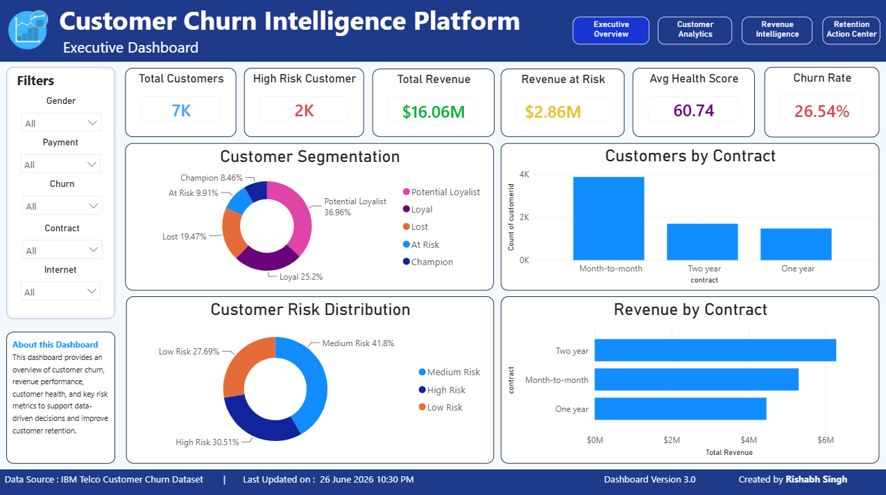
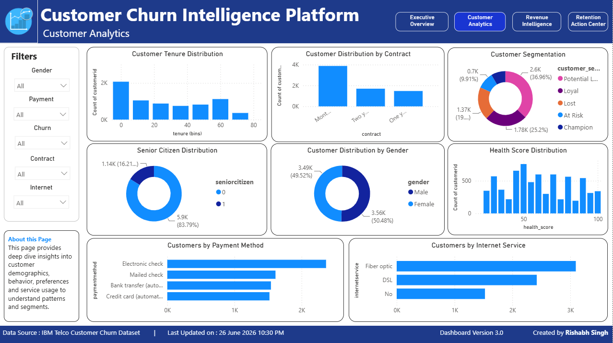
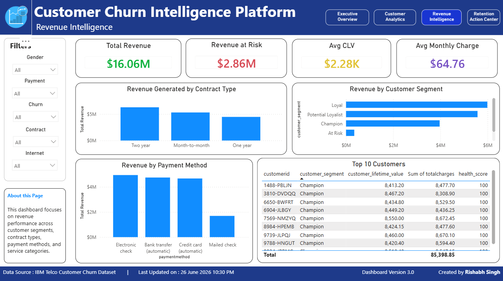
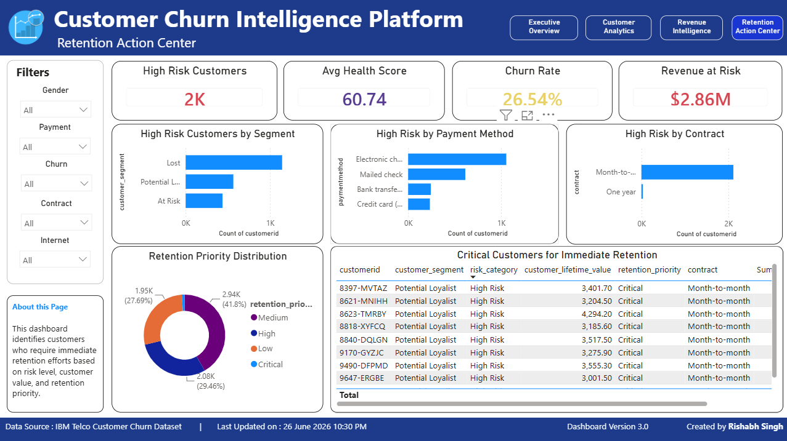

# 📊 Customer Churn Intelligence Platform

> **An End-to-End Customer Analytics & Business Intelligence Platform built using Python, PostgreSQL, SQL, and Power BI to analyze customer behavior, identify churn drivers, quantify revenue risk, and deliver executive-level business insights through interactive dashboards.**

<p align="center">


</p>

---

## 🚀 Project Evolution

| Version | Status | Description |
|----------|--------|-------------|
| **V1** | ✅ Completed | Customer Analytics using Python, Pandas & Data Visualization |
| **V2** | ✅ Completed | PostgreSQL Analytics Layer with SQL Views, CTEs & Window Functions |
| **V3** | ✅ Completed | Interactive Multi-Page Power BI Executive Dashboard |
| **V4** | 🔜 Planned | Machine Learning Churn Prediction & Predictive Analytics |

---
# 📖 Project Overview

Customer churn is one of the biggest challenges faced by subscription-based businesses. Studies consistently show that retaining an existing customer is significantly more cost-effective than acquiring a new one, making customer retention a critical business objective.

The **Customer Churn Intelligence Platform** is an end-to-end Customer Analytics and Business Intelligence project designed to transform raw customer data into actionable business insights. The platform combines **Python**, **PostgreSQL**, and **Power BI** to simulate a real-world analytics workflow used by Data Analysts and Business Intelligence teams.

The project follows a layered architecture where each version builds upon the previous one:

- **V1** focused on data cleaning, exploratory data analysis, customer segmentation, and health score generation using Python.
- **V2** introduced a PostgreSQL-powered analytics layer featuring SQL-based data transformation, business KPI generation, customer segmentation, health scoring, Common Table Expressions (CTEs), Window Functions, and reusable analytical Views.
- **V3** extends the platform with a fully interactive multi-page Power BI dashboard that enables executive reporting, customer analytics, revenue intelligence, and retention planning through dynamic visualizations and business-focused insights.

Rather than building isolated notebooks or dashboards, this project demonstrates the complete lifecycle of a modern Business Intelligence solution—from raw data ingestion to executive decision-making.

---

# 🎯 Business Objectives

The primary objective of this project is to answer critical business questions such as:

- Why are customers leaving?
- Which customers have the highest probability of churn?
- Which customer segments generate the highest business value?
- How much revenue is currently at risk?
- Which customers should be prioritized for retention campaigns?
- What business strategies can improve customer retention and profitability?

The insights generated through this platform enable data-driven decision making across Customer Success, Marketing, Finance, and Executive Leadership teams.

---

# ✨ Key Features

### 📊 Data Analytics

- Comprehensive Data Cleaning
- Exploratory Data Analysis (EDA)
- Business KPI Generation
- Customer Behavior Analysis

### 🗄️ SQL Analytics Layer

- PostgreSQL Database Design
- SQL Data Cleaning
- Business Queries
- Customer Segmentation
- Revenue Risk Analysis
- Health Score Calculation
- SQL Views
- Common Table Expressions (CTEs)
- Window Functions
- Aggregate Analysis

### 📈 Business Intelligence

- Executive KPI Dashboard
- Customer Analytics Dashboard
- Revenue Intelligence Dashboard
- Retention Action Center
- Interactive Filters & Drilldowns
- Dynamic KPI Monitoring

### 📉 Customer Intelligence

- Customer Segmentation
- Customer Health Score
- Revenue Risk Classification
- Retention Priority Identification
- High-Value Customer Analysis

### 🚀 Project Highlights

✔ End-to-End Analytics Pipeline

✔ SQL-Powered Business Intelligence

✔ Multi-Page Interactive Power BI Dashboard

✔ Customer Health Scoring Engine

✔ Revenue Risk Analytics

✔ Executive-Level Reporting

✔ Business-Oriented Insights

✔ Production-Style Analytics Workflow

---

# 💼 Business Use Case

Imagine you are a Business Intelligence Analyst working for a subscription-based telecommunications company.

The leadership team wants a centralized analytics solution that enables them to monitor customer health, identify churn risks, analyze revenue exposure, understand customer behavior, and prioritize retention efforts through interactive dashboards.

The **Customer Churn Intelligence Platform** addresses these challenges by integrating data engineering, analytics, SQL, and business intelligence into a unified reporting solution that supports data-driven business decisions.

# 🏗️ Project Architecture

The Customer Churn Intelligence Platform follows a layered Business Intelligence architecture where each stage transforms raw customer data into meaningful business insights.

```text
                           IBM Telco Customer Churn Dataset
                                         │
                                         ▼
                           ┌─────────────────────────┐
                           │    Data Cleaning Layer   │
                           │ Python • Pandas • NumPy  │
                           └─────────────────────────┘
                                         │
                                         ▼
                           ┌─────────────────────────┐
                           │ PostgreSQL Database      │
                           │ Relational Data Storage  │
                           └─────────────────────────┘
                                         │
                                         ▼
                    ┌─────────────────────────────────────────┐
                    │        SQL Analytics Layer              │
                    │                                         │
                    │ • Data Cleaning                         │
                    │ • Business KPI Generation               │
                    │ • Customer Segmentation                 │
                    │ • Health Score Calculation              │
                    │ • Revenue Risk Analysis                 │
                    │ • SQL Views                             │
                    │ • CTEs                                  │
                    │ • Window Functions                      │
                    └─────────────────────────────────────────┘
                                         │
                                         ▼
                        ┌────────────────────────────────┐
                        │ Power BI Executive Dashboard   │
                        └────────────────────────────────┘
                                         │
          ┌──────────────┬───────────────┬───────────────┬───────────────┐
          ▼              ▼               ▼               ▼
 Executive Overview  Customer Analytics Revenue Intelligence Retention Center
          │              │               │               │
          └──────────────┴───────────────┴───────────────┘
                                         ▼
                          Executive Decision Making
```

---

## 🔄 End-to-End Analytics Workflow

```text
Raw Dataset
     │
     ▼
Data Cleaning & Validation
     │
     ▼
Exploratory Data Analysis
     │
     ▼
PostgreSQL Database
     │
     ▼
SQL Analytics Layer
     │
     ├── Customer Segmentation
     ├── Customer Health Score
     ├── Revenue Risk Analysis
     ├── Business KPIs
     ├── SQL Views
     └── Executive Metrics
     │
     ▼
Power BI Dashboard
     │
     ├── Executive Overview
     ├── Customer Analytics
     ├── Revenue Intelligence
     └── Retention Action Center
     │
     ▼
Business Insights & Decision Making
```

---

# 🎯 Analytics Pipeline

The project is designed around a production-style analytics pipeline where each technology serves a specific role.

| Layer | Purpose | Technology |
|--------|----------|------------|
| Data Collection | Raw Customer Dataset | IBM Telco Customer Churn |
| Data Cleaning | Missing Values & Data Quality | Python, Pandas |
| Database | Centralized Data Storage | PostgreSQL |
| SQL Analytics | Business Logic & KPI Generation | PostgreSQL SQL |
| Business Intelligence | Interactive Reporting | Power BI |
| Version Control | Project Management | Git & GitHub |

---

# ⚙️ System Components

### 📂 Data Layer

Responsible for ingesting and cleaning raw customer data before loading it into the analytics database.

---

### 🗄 Database Layer

Stores structured customer information inside PostgreSQL and serves as the primary data source for analytical queries.

---

### 📊 SQL Analytics Layer

Transforms raw transactional data into meaningful business information through reusable SQL scripts, Views, Common Table Expressions (CTEs), Window Functions, and KPI calculations.

---

### 📈 Business Intelligence Layer

Provides interactive dashboards that allow business users to explore customer behavior, monitor KPIs, analyze revenue, and identify customers requiring retention efforts.

---

### 👨‍💼 Decision Layer

Converts analytical insights into business actions that support executive reporting, customer retention strategies, and revenue optimization.

---

# 💡 Why this Architecture?

Instead of performing all analysis inside a Jupyter Notebook, this project follows a layered architecture similar to enterprise Business Intelligence solutions.

Separating data processing, SQL analytics, and dashboard visualization improves scalability, maintainability, and reusability while demonstrating a real-world analytics workflow used by Data Analysts and Business Intelligence teams.

# 📂 Dataset & Business Problem

## 📊 Dataset Overview

The project uses the **IBM Telco Customer Churn Dataset**, one of the most widely used benchmark datasets for customer retention and churn analytics.

The dataset contains customer demographic information, subscription details, service usage, billing information, and churn status, making it ideal for exploring customer behavior and business performance.

---

## 📋 Dataset Summary

| Attribute | Value |
|-----------|-------|
| Dataset | IBM Telco Customer Churn |
| Industry | Telecommunications |
| Records | **7,043** |
| Features | **21** |
| Target Variable | **Churn** |
| File Format | CSV |
| Database | PostgreSQL |
| Dashboard | Power BI |

---

## 📑 Key Dataset Attributes

The dataset contains customer information across multiple business dimensions.

### 👤 Customer Information

- Customer ID
- Gender
- Senior Citizen
- Partner
- Dependents

---

### 📅 Subscription Information

- Tenure
- Contract Type
- Paperless Billing
- Payment Method

---

### 🌐 Service Information

- Phone Service
- Multiple Lines
- Internet Service
- Online Security
- Online Backup
- Device Protection
- Tech Support
- Streaming TV
- Streaming Movies

---

### 💰 Financial Information

- Monthly Charges
- Total Charges

---

### 🎯 Target Variable

- Churn (Yes / No)

---

# 🎯 Business Problem

Customer retention is one of the most important challenges for subscription-based businesses.

Every customer who leaves the company not only reduces recurring revenue but also increases customer acquisition costs. Understanding why customers churn and identifying customers who require retention efforts are essential for sustainable business growth.

The objective of this project is to transform raw customer data into actionable business intelligence that enables decision-makers to proactively reduce churn and improve customer lifetime value.

---

# ❓ Business Questions Answered

This project addresses several key business questions.

### Customer Behavior

- What is the overall customer churn rate?
- Which customer segments are most likely to churn?
- Which customers generate the highest value?

---

### Revenue Analysis

- How much revenue is currently at risk?
- Which contract types generate the highest revenue?
- Which payment methods are associated with higher churn?

---

### Customer Retention

- Which customers should be contacted first?
- Which customer segments require immediate attention?
- How can customer health be monitored over time?

---

### Executive Reporting

- What KPIs should executives monitor?
- Which business metrics indicate customer loyalty?
- Which trends require strategic intervention?

---

# 📈 Business Objectives

The primary goals of the Customer Churn Intelligence Platform are to:

- Reduce customer churn through data-driven insights.
- Identify high-risk customers before they leave.
- Measure customer health using business rules.
- Quantify revenue exposure due to churn.
- Segment customers based on engagement and value.
- Enable executive-level reporting through interactive dashboards.
- Support informed business decision-making.

---

# 💡 Analytical Goals

The project was designed to demonstrate an end-to-end Business Intelligence workflow covering multiple analytical domains.

### ✔ Data Preparation

- Data Cleaning
- Missing Value Handling
- Data Type Conversion
- Data Validation

---

### ✔ SQL Analytics

- Business KPI Generation
- Customer Segmentation
- Revenue Risk Analysis
- Customer Health Score
- SQL Views
- CTEs
- Window Functions

---

### ✔ Business Intelligence

- Executive Dashboard
- Customer Analytics Dashboard
- Revenue Intelligence Dashboard
- Retention Action Center

---

### ✔ Decision Support

The final dashboards provide business users with interactive insights that help prioritize customer retention efforts, monitor business performance, and identify opportunities for revenue optimization.

---

# 🎯 Expected Business Impact

By integrating SQL analytics with interactive dashboards, this platform enables organizations to:

- Improve customer retention strategies.
- Identify revenue leakage.
- Prioritize high-value customers.
- Support executive decision-making.
- Increase customer lifetime value.
- Monitor key business metrics through real-time visual reporting.

# 📊 Interactive Power BI Dashboard

Version 3 of the Customer Churn Intelligence Platform introduces a fully interactive **four-page Executive Business Intelligence Dashboard** built using **Microsoft Power BI**.

The dashboard transforms SQL-generated business metrics into actionable visual insights that support executive reporting, customer success strategies, revenue monitoring, and retention planning.

Each dashboard page is designed for a specific business audience, allowing users to move seamlessly from high-level KPIs to detailed customer analysis and retention recommendations.

---

## 🏠 Executive Overview

> **A high-level executive dashboard providing a comprehensive overview of customer health, churn, revenue, and business performance.**



### Key Insights

- Overall Customer Churn Rate
- Total Customers
- Revenue at Risk
- Customer Health Score
- Customer Segmentation
- Customer Risk Distribution
- Contract Distribution
- Revenue by Contract Type

### Designed For

- Executive Leadership
- Business Managers
- Customer Success Directors

---

## 👥 Customer Analytics

> **Provides detailed insights into customer demographics, behavior, service adoption, engagement, and segmentation.**



### Key Insights

- Gender Distribution
- Senior Citizen Analysis
- Contract Type Distribution
- Payment Method Analysis
- Internet Service Adoption
- Customer Segmentation
- Customer Tenure Distribution
- Customer Health Score Distribution

### Designed For

- Customer Success Teams
- CRM Analysts
- Marketing Teams

---

## 💰 Revenue Intelligence

> **Analyzes revenue generation, customer lifetime value, financial exposure, and profitability across customer segments.**



### Key Insights

- Total Revenue
- Revenue at Risk
- Customer Lifetime Value
- Revenue by Contract Type
- Revenue by Customer Segment
- Revenue by Payment Method
- Top High-Value Customers

### Designed For

- Finance Teams
- Revenue Analysts
- Business Intelligence Analysts

---

## 🚨 Retention Action Center

> **Prioritizes high-risk customers and recommends data-driven retention strategies to minimize customer churn and protect recurring revenue.**



### Key Insights

- High Risk Customers
- Retention Priority
- Revenue at Risk
- High Risk Customer Segments
- High Risk Contract Types
- Critical Customer List
- Retention Recommendations

### Designed For

- Customer Success Teams
- Retention Specialists
- Sales & Support Teams

---

# 🎯 Dashboard Features

### 📈 Executive Reporting

- Executive KPI Monitoring
- Business Performance Overview
- Revenue Tracking
- Churn Monitoring

---

### 🔍 Interactive Analysis

- Dynamic Filters
- Multi-Page Navigation
- Drill-Down Analysis
- Cross-Visual Filtering

---

### 📊 Business Intelligence

- Customer Segmentation
- Customer Health Scoring
- Revenue Intelligence
- Risk Classification
- Retention Prioritization

---

### 🎨 Dashboard Design

- Modern Executive Layout
- Professional Color Theme
- Interactive Navigation
- Responsive Visualizations
- Business-Oriented Design

---

# 📸 Dashboard Gallery

| Dashboard | Purpose |
|------------|---------|
| 📊 Executive Overview | Executive KPI Monitoring |
| 👥 Customer Analytics | Customer Behavior Analysis |
| 💰 Revenue Intelligence | Revenue & Profitability Analysis |
| 🚨 Retention Action Center | Customer Retention Strategy |

---

> **The Power BI dashboard represents the Business Intelligence layer of the Customer Churn Intelligence Platform, enabling business users to transform SQL-generated metrics into interactive executive reports for data-driven decision making.**

# ✨ Key Features

The Customer Churn Intelligence Platform combines **Data Analytics**, **SQL Engineering**, and **Business Intelligence** into a single end-to-end analytics solution.

---

## 📊 Data Analytics

Transform raw customer data into meaningful business insights through data cleaning, preprocessing, and exploratory analysis.

### Features

- ✅ Missing Value Detection & Handling
- ✅ Data Type Validation
- ✅ Business Rule Validation
- ✅ Exploratory Data Analysis (EDA)
- ✅ Statistical Analysis
- ✅ Customer Behavior Analysis
- ✅ Business KPI Generation

---

## 🗄️ PostgreSQL Analytics Layer

A dedicated SQL analytics layer built to simulate enterprise-grade reporting systems.

### Features

- ✅ Relational Database Design
- ✅ SQL Data Cleaning
- ✅ Business KPI Calculations
- ✅ Customer Segmentation
- ✅ Customer Health Score Engine
- ✅ Revenue Risk Analysis
- ✅ Analytical SQL Views
- ✅ Common Table Expressions (CTEs)
- ✅ Window Functions
- ✅ Aggregate Analysis
- ✅ Ranking & Business Metrics

---

## 📈 Business Intelligence Dashboard

A fully interactive Power BI dashboard designed for executive reporting and operational decision-making.

### Dashboard Pages

### 📊 Executive Overview

- Executive KPI Monitoring
- Customer Churn Overview
- Revenue Performance
- Customer Health Analysis
- Business Summary

---

### 👥 Customer Analytics

- Customer Demographics
- Contract Analysis
- Internet Service Analysis
- Payment Method Analysis
- Customer Segmentation
- Customer Tenure Analysis

---

### 💰 Revenue Intelligence

- Revenue Performance
- Revenue by Contract
- Customer Lifetime Value
- Revenue at Risk
- Revenue by Customer Segment
- Top Revenue Customers

---

### 🚨 Retention Action Center

- High Risk Customers
- Retention Priority
- Revenue Exposure
- High Risk Segments
- Customer Retention Planning
- Actionable Recommendations

---

## 🎯 Customer Intelligence

The project introduces multiple business-focused analytical models.

### Customer Segmentation

Customers are classified into:

- 🏆 Champion
- ⭐ Loyal
- 🌱 Potential Loyalist
- ⚠ At Risk
- ❌ Lost

---

### Customer Health Score

Each customer receives a custom health score based on:

- Customer Tenure
- Contract Type
- Monthly Charges
- Total Charges

Customers are automatically classified into:

- 🟢 Low Risk
- 🟡 Medium Risk
- 🔴 High Risk

---

### Revenue Intelligence

Revenue metrics include:

- Total Revenue
- Revenue at Risk
- Average Monthly Revenue
- Customer Lifetime Value
- Revenue Contribution by Segment
- Revenue by Contract Type

---

### Business Decision Support

The platform enables organizations to:

- Identify customers likely to churn
- Prioritize retention campaigns
- Monitor executive KPIs
- Track customer health
- Analyze revenue trends
- Optimize customer lifetime value

---

# 🚀 Highlights

✔ End-to-End Analytics Workflow

✔ Enterprise-Style SQL Analytics Layer

✔ Multi-Page Power BI Executive Dashboard

✔ Customer Health Score Engine

✔ Revenue Intelligence Framework

✔ Customer Segmentation Engine

✔ Revenue Risk Analysis

✔ Interactive Business Dashboards

✔ Executive KPI Monitoring

✔ Production-Style Project Architecture

✔ Real Business Use Case

✔ Portfolio-Ready Documentation

---

# 💼 Skills Demonstrated

### Data Analytics

- Data Cleaning
- Data Validation
- Exploratory Data Analysis
- Statistical Analysis

---

### SQL & Database

- PostgreSQL
- SQL
- Views
- CTEs
- Window Functions
- Aggregate Functions
- CASE Statements
- Business KPIs

---

### Business Intelligence

- Microsoft Power BI
- Dashboard Design
- Executive Reporting
- Interactive Visualizations
- KPI Development
- Data Storytelling

---

### Software Engineering

- Git
- GitHub
- Version Control
- Documentation
- Project Organization

---

## 🌟 Why This Project Stands Out

Unlike traditional customer churn projects that focus only on predictive analytics or dashboard creation, this project demonstrates the complete lifecycle of a Business Intelligence solution.

From raw data ingestion and SQL analytics to executive reporting and customer retention planning, every stage of the workflow is designed to mirror how modern Data Analysts and Business Intelligence teams solve real-world business problems.

The platform is built incrementally across multiple versions, showcasing continuous improvement, modular design, and scalable architecture—an approach commonly followed in professional software and analytics projects.

# 🛠️ Technology Stack

The Customer Churn Intelligence Platform integrates multiple technologies across the complete Business Intelligence workflow. Each technology serves a specific purpose within the analytics pipeline.

---

## 💻 Programming & Data Analytics

| Technology | Purpose |
|------------|---------|
| **Python** | Data Cleaning, Exploratory Data Analysis & Feature Engineering |
| **Pandas** | Data Manipulation & Transformation |
| **NumPy** | Numerical Computing |
| **Matplotlib** | Data Visualization |
| **Seaborn** | Statistical Data Visualization |

---

## 🗄️ Database & SQL

| Technology | Purpose |
|------------|---------|
| **PostgreSQL** | Relational Database Management |
| **pgAdmin** | Database Administration |
| **SQL** | Business Analytics & Querying |
| **Views** | Reusable Business Reports |
| **CTEs** | Complex Analytical Queries |
| **Window Functions** | Customer Ranking & Advanced Analytics |

---

## 📊 Business Intelligence

| Technology | Purpose |
|------------|---------|
| **Microsoft Power BI** | Executive Dashboard Development |
| **Power Query** | Data Transformation |
| **DAX** | KPI & Business Metric Calculations |

---

## ⚙️ Development Tools

| Technology | Purpose |
|------------|---------|
| **VS Code** | Development Environment |
| **Jupyter Notebook** | Analytics & Prototyping |
| **Git** | Version Control |
| **GitHub** | Repository Hosting & Collaboration |

---

# 📚 SQL Concepts Demonstrated

The PostgreSQL Analytics Layer demonstrates practical SQL concepts commonly used in production Business Intelligence systems.

### Data Definition Language (DDL)

- CREATE DATABASE
- CREATE TABLE
- ALTER TABLE

---

### Data Manipulation Language (DML)

- INSERT
- UPDATE
- DELETE

---

### Querying

- SELECT
- WHERE
- GROUP BY
- ORDER BY
- HAVING
- LIMIT
- DISTINCT

---

### Advanced SQL

- CASE WHEN
- Common Table Expressions (CTEs)
- Window Functions
- Aggregate Functions
- Views
- Joins
- Subqueries

---

### Business Analytics

- Customer Segmentation
- Revenue Analysis
- Customer Health Score
- Revenue Risk Analysis
- Customer Ranking
- Executive KPI Generation

---

# 📁 Repository Structure

```text
Customer-Churn-Intelligence-Platform/
│
├── 📂 data/
│   ├── raw/
│   │   └── WA_Fn-UseC_-Telco-Customer-Churn.csv
│   │
│   └── cleaned/
│       ├── customer_clean.csv
│       └── customer_health_dataset.csv
│
├── 📂 notebooks/
│   ├── 01_data_understanding.ipynb
│   ├── 02_data_cleaning.ipynb
│   ├── 03_eda.ipynb
│   ├── 04_customer_segmentation.ipynb
│   ├── 05_health_score.ipynb
│   └── 06_business_report.ipynb
│
├── 📂 database/
│   ├── schema.sql
│   ├── load_data.sql
│   ├── views.sql
│   └── analytics_queries.sql
│
├── 📂 sql/
│   ├── 01_data_exploration.sql
│   ├── 02_customer_analysis.sql
│   ├── 03_customer_segmentation.sql
│   ├── 04_health_score.sql
│   ├── 05_revenue_risk.sql
│   ├── 06_cte_analysis.sql
│   └── 07_window_functions.sql
│
├── 📂 powerbi/
│   └── Customer_Churn_Dashboard.pbix
│
├── 📂 screenshots/
│   ├── executive_overview.png
│   ├── customer_analytics.png
│   ├── revenue_intelligence.png
│   ├── retention_action_center.png
│   └── dashboard_preview.png
│
├── 📂 docs/
│
├── README.md
├── LICENSE
└── requirements.txt
```

---

# 📦 Project Deliverables

This repository includes everything required to understand, reproduce, and extend the project.

### ✅ Data Analytics

- Raw Dataset
- Cleaned Dataset
- Jupyter Notebooks
- Business Reports

---

### ✅ Database

- PostgreSQL Schema
- SQL Scripts
- Views
- Analytics Queries

---

### ✅ Business Intelligence

- Power BI Dashboard (.pbix)
- Dashboard Screenshots
- Interactive Reports

---

### ✅ Documentation

- Comprehensive README
- Project Architecture
- Business Workflow
- Setup Guide
- Release History

---

# 🎯 Design Philosophy

The repository is organized to reflect a production-style analytics workflow.

Instead of combining all logic into a single notebook, each stage of the analytics pipeline is separated into dedicated modules, making the project easier to understand, maintain, and extend.

This modular structure mirrors how Business Intelligence and Analytics projects are commonly organized in enterprise environments, where data preparation, SQL analytics, visualization, and documentation are maintained independently.

# ⚙️ Analytics Workflow & SQL Analytics Layer

The Customer Churn Intelligence Platform is designed around a production-style analytics pipeline where raw customer data is progressively transformed into business-ready insights.

Rather than performing all analysis inside a notebook, the project separates data processing, SQL analytics, and business visualization into independent layers, closely following how Business Intelligence solutions are developed in industry.

---

# 🔄 End-to-End Analytics Workflow

```text
Raw Customer Dataset
        │
        ▼
Data Cleaning & Validation
        │
        ▼
PostgreSQL Database
        │
        ▼
SQL Analytics Layer
        │
 ┌──────┼────────────────────────────┐
 │      │                            │
 ▼      ▼                            ▼
Customer Health Score        Customer Segmentation
 │      │                            │
 └──────┼────────────────────────────┘
        ▼
Revenue Risk Analysis
        │
        ▼
Business KPI Generation
        │
        ▼
SQL Views
        │
        ▼
Power BI Executive Dashboard
        │
        ▼
Executive Decision Making
```

---

# 🧹 Data Cleaning & Data Quality Management

High-quality analytics begin with high-quality data.

Before performing any business analysis, the dataset was carefully validated and cleaned to ensure consistency and reliability.

## Data Quality Checks

- Missing Value Detection
- Blank String Investigation
- Duplicate Record Detection
- Data Type Validation
- Business Rule Validation
- Data Integrity Checks

---

## Key Cleaning Tasks

### Missing Values

The `TotalCharges` column contained **11 blank values**.

Business investigation revealed that all affected customers had:

```text
Tenure = 0 Months
```

Instead of removing these records, business logic was applied:

```text
TotalCharges = 0
```

This preserved customer history while maintaining analytical accuracy.

---

### Data Type Conversion

The original dataset stored `TotalCharges` as a text field.

Using PostgreSQL, the column was converted to:

```sql
NUMERIC(10,2)
```

allowing mathematical calculations and revenue analysis.

---

# 📊 SQL Analytics Layer

The SQL Analytics Layer is responsible for transforming raw transactional data into reusable business information.

Rather than writing one large SQL script, the project is divided into modular analytical components.

---

## 1️⃣ Customer Analytics

Business questions answered:

- How many customers does the company have?
- What is the overall churn rate?
- Which customers generate the highest value?
- Which contract types retain customers?

---

## 2️⃣ Customer Segmentation

Customers were segmented using SQL CASE expressions based on tenure and spending behaviour.

### Segments

| Segment | Business Meaning |
|----------|------------------|
| 🏆 Champion | Highest customer value |
| ⭐ Loyal | Long-term stable customers |
| 🌱 Potential Loyalist | Growing customer value |
| ⚠ At Risk | Requires retention efforts |
| ❌ Lost | Low engagement customers |

This segmentation enables targeted marketing and retention strategies.

---

## 3️⃣ Customer Health Score Engine

One of the unique components of this project is a custom Customer Health Score.

The score combines multiple business indicators:

- Customer Tenure
- Monthly Charges
- Total Charges
- Contract Commitment

Each customer receives a numerical score and is classified into one of three risk groups.

### Risk Categories

| Category | Meaning |
|-----------|----------|
| 🟢 Low Risk | Strong retention indicators |
| 🟡 Medium Risk | Requires monitoring |
| 🔴 High Risk | Immediate retention attention |

This score acts as a simplified customer success metric for prioritizing business actions.

---

## 4️⃣ Revenue Intelligence

The project quantifies financial exposure caused by customer churn.

Revenue analytics include:

- Total Revenue
- Revenue at Risk
- Average Monthly Revenue
- Revenue by Contract
- Revenue by Customer Segment
- Revenue by Payment Method

Instead of only predicting churn, the platform measures the financial impact of customer loss.

---

## 5️⃣ Business KPI Generation

The platform calculates executive KPIs including:

- Customer Count
- Churn Rate
- Revenue at Risk
- Customer Health Score
- High-Risk Customers
- Customer Lifetime Value
- Contract Distribution

These KPIs are later consumed directly by the Power BI dashboard.

---

# 🏗 SQL Views

To improve maintainability and dashboard performance, reusable SQL Views were created.

### Analytical Views

### `vw_customer_segments`

Generates customer segments based on business rules.

---

### `vw_customer_health`

Calculates Customer Health Score and Risk Category.

---

### `vw_revenue_risk`

Measures revenue exposure caused by churn.

---

### `vw_top_customers`

Ranks customers based on Customer Lifetime Value using SQL Window Functions.

---

# 📚 Advanced SQL Concepts Demonstrated

This project demonstrates several SQL concepts commonly used in enterprise analytics.

### Querying

- SELECT
- WHERE
- GROUP BY
- HAVING
- ORDER BY
- DISTINCT
- LIMIT

---

### Conditional Logic

- CASE WHEN
- Nested CASE Expressions

---

### Data Transformation

- ALTER TABLE
- UPDATE
- CAST
- Data Type Conversion

---

### Advanced Analytics

- Common Table Expressions (CTEs)
- Window Functions
- ROW_NUMBER()
- RANK()
- Aggregate Functions

---

### Database Objects

- Views
- Reusable SQL Scripts

---

# 💡 Why PostgreSQL?

Rather than relying solely on Python for analytics, PostgreSQL was chosen to simulate an enterprise Business Intelligence environment.

Using SQL as the primary analytics engine offers several advantages:

- Reusable business logic
- Improved scalability
- Faster aggregation queries
- Easier dashboard integration
- Separation of analytics and visualization
- Production-ready workflow

This mirrors the architecture commonly used in modern Business Intelligence teams where SQL serves as the foundation for reporting and dashboard development.

---

# 📈 Business Impact

The SQL Analytics Layer transforms raw customer records into meaningful business intelligence that enables organizations to:

- Monitor customer health
- Quantify revenue exposure
- Identify high-value customers
- Prioritize retention campaigns
- Support executive reporting
- Drive data-informed decision making

The resulting analytics provide the foundation for the interactive Power BI dashboards developed in Version 3 of the project.

# 📈 Business Insights & Key Findings

The Customer Churn Intelligence Platform was developed to move beyond descriptive reporting and generate actionable business insights. Through exploratory analysis, SQL analytics, and interactive dashboards, several important customer behavior patterns were identified.

---

# 📊 Executive KPIs

The platform continuously monitors key business metrics that provide executives with an overview of customer performance.

| KPI | Value |
|------|-------:|
| Total Customers | **7,043** |
| Churn Rate | **26.54%** |
| Average Customer Health Score | **37.35** |
| High-Risk Customers | **4,103** |
| Revenue at Risk | **$3.70M** |

These KPIs provide a high-level summary of customer retention, financial exposure, and business performance.

---

# 🔍 Key Business Insights

## 1️⃣ Customer Churn Rate

Approximately **26.5%** of customers have churned.

This indicates that nearly **1 in every 4 customers** has left the company, highlighting the importance of proactive customer retention strategies.

### Business Recommendation

- Strengthen customer engagement programs.
- Monitor customer health scores regularly.
- Launch targeted retention campaigns for high-risk customers.

---

## 2️⃣ Contract Type Has the Greatest Impact on Churn

Customers with **Month-to-Month contracts** exhibit the highest churn rate, while customers with **Two-Year contracts** demonstrate the strongest customer retention.

### Business Recommendation

- Encourage customers to upgrade to annual or two-year contracts.
- Provide discounts or loyalty rewards for long-term subscriptions.
- Design promotional campaigns targeting Month-to-Month customers.

---

## 3️⃣ Revenue Distribution

Analysis revealed that **Two-Year contracts generate the highest overall revenue**, making them the most valuable customer segment from a financial perspective.

### Business Recommendation

- Promote long-term subscription plans.
- Offer contract renewal incentives.
- Focus sales efforts on customers with high long-term value.

---

## 4️⃣ Revenue at Risk

The platform estimates that approximately **$3.70 Million** in revenue is associated with customers who have already churned.

This metric quantifies the financial impact of customer attrition and highlights the importance of effective retention strategies.

### Business Recommendation

- Prioritize high-value customers showing early signs of churn.
- Develop proactive customer success initiatives.
- Monitor revenue exposure as a core executive KPI.

---

## 5️⃣ Customer Health Score

A custom Customer Health Score was developed using:

- Customer Tenure
- Contract Type
- Monthly Charges
- Total Charges

Customers are classified into:

- 🟢 Low Risk
- 🟡 Medium Risk
- 🔴 High Risk

This scoring system allows business teams to identify customers requiring immediate attention before churn occurs.

### Business Recommendation

Integrate the Health Score into CRM systems to prioritize customer outreach and retention efforts.

---

## 6️⃣ Customer Segmentation

Customers were segmented into five business-oriented groups:

| Segment | Purpose |
|----------|----------|
| 🏆 Champion | Highest-value customers |
| ⭐ Loyal | Stable long-term customers |
| 🌱 Potential Loyalist | Growing customer value |
| ⚠ At Risk | Customers requiring intervention |
| ❌ Lost | Customers with low engagement |

This segmentation enables personalized marketing and customer success strategies.

---

## 7️⃣ Payment Method Analysis

Customers using **Electronic Check** exhibited the highest churn rate compared to other payment methods.

### Business Recommendation

- Encourage migration to automatic payment methods.
- Offer incentives for customers switching to recurring payment options.
- Investigate customer experience issues associated with Electronic Check payments.

---

## 8️⃣ Customer Tenure Analysis

New customers with lower tenure are significantly more likely to churn compared to long-term subscribers.

### Business Recommendation

- Improve customer onboarding experiences.
- Increase engagement during the first three months.
- Develop early-life retention campaigns.

---

## 9️⃣ Revenue Concentration

Revenue analysis identified a relatively small group of customers contributing a significant portion of total revenue.

These customers represent critical business assets and should receive premium customer success support.

### Business Recommendation

- Identify VIP customers.
- Offer loyalty benefits.
- Prioritize customer satisfaction initiatives.

---

## 🔟 High-Risk Customer Identification

The Retention Action Center highlights customers requiring immediate intervention based on:

- Customer Health Score
- Revenue Contribution
- Contract Type
- Churn Risk
- Customer Segment

This enables customer success teams to focus their efforts where they deliver the greatest business impact.

---

# 💼 Business Recommendations

Based on the analysis, the following strategic initiatives are recommended.

---

## 🎯 Customer Retention

- Increase long-term contract adoption.
- Launch personalized retention campaigns.
- Monitor customer health continuously.
- Improve customer onboarding.

---

## 💰 Revenue Optimization

- Protect high-value customers.
- Monitor revenue at risk.
- Increase Customer Lifetime Value.
- Encourage automatic payment methods.

---

## 📈 Customer Success

- Prioritize High-Risk customers.
- Reward loyal customers.
- Identify early warning signals.
- Reduce customer acquisition costs through better retention.

---

## 📊 Executive Reporting

Executives should continuously monitor:

- Customer Churn Rate
- Revenue at Risk
- Customer Health Score
- High-Risk Customer Count
- Customer Lifetime Value
- Contract Distribution
- Revenue by Segment

These KPIs provide a comprehensive overview of business performance and customer retention.

---

# 🌟 Project Impact

The Customer Churn Intelligence Platform transforms raw customer data into strategic business intelligence by combining Python analytics, PostgreSQL, SQL, and Power BI into a unified decision-support system.

Rather than simply reporting historical trends, the platform enables organizations to identify customer risk, quantify financial exposure, prioritize retention efforts, and support executive decision-making through interactive, data-driven insights.

This project demonstrates how modern Business Intelligence solutions can bridge the gap between technical analytics and business strategy.

# 🚀 Getting Started

Follow the steps below to set up and explore the Customer Churn Intelligence Platform on your local machine.

---

# 📋 Prerequisites

Before running the project, ensure you have the following software installed:

| Software | Version |
|----------|---------|
| Python | 3.10+ |
| PostgreSQL | 14+ |
| pgAdmin | Latest |
| Microsoft Power BI Desktop | Latest |
| Git | Latest |
| Jupyter Notebook | Latest |

---

# 📥 Clone the Repository

```bash
git clone https://github.com/RishabhSingh290306/Customer-Churn-Intelligence-Platform.git

cd Customer-Churn-Intelligence-Platform
```

---

# 🐍 Install Python Dependencies

```bash
pip install -r requirements.txt
```

---

# 🗄 PostgreSQL Setup

Create a PostgreSQL database.

```sql
CREATE DATABASE customer_churn;
```

Open pgAdmin and execute:

- `schema.sql`
- `load_data.sql`
- `views.sql`

This will create all required tables and analytical views.

---

# 📊 Run the Jupyter Notebooks

Launch Jupyter Notebook.

```bash
jupyter notebook
```

Run the notebooks in the following order:

1. Data Understanding
2. Data Cleaning
3. Exploratory Data Analysis
4. Customer Segmentation
5. Customer Health Score
6. Business Report

---

# 📈 Open the Power BI Dashboard

Navigate to:

```text
powerbi/
```

Open:

```text
Customer_Churn_Dashboard.pbix
```

Refresh the data if required.

You can now explore all four dashboard pages:

- 📊 Executive Overview
- 👥 Customer Analytics
- 💰 Revenue Intelligence
- 🚨 Retention Action Center

---

# 🎛 Dashboard Navigation

The dashboard contains interactive filters that allow users to explore customer behavior dynamically.

### Available Filters

- Gender
- Contract Type
- Internet Service
- Payment Method
- Churn Status

Each filter updates all relevant charts and KPIs in real time.

---

# 📁 Repository Structure

```text
Customer-Churn-Intelligence-Platform
│
├── data/
│
├── database/
│
├── sql/
│
├── notebooks/
│
├── powerbi/
│
├── screenshots/
│
├── README.md
│
└── requirements.txt
```

---

# 📌 Dashboard Features

### Executive Overview

Monitor overall business performance through executive KPIs.

---

### Customer Analytics

Analyze customer demographics, contracts, services, and behavioral trends.

---

### Revenue Intelligence

Understand revenue distribution, high-value customers, and financial exposure.

---

### Retention Action Center

Identify high-risk customers and prioritize retention strategies.

---

# 🔄 Project Workflow

```text
Raw Dataset
      │
      ▼
Python Cleaning
      │
      ▼
PostgreSQL Database
      │
      ▼
SQL Analytics
      │
      ▼
Power BI Dashboard
      │
      ▼
Business Decisions
```

---

# 🎯 Intended Audience

This project is suitable for:

- Data Analysts
- Business Intelligence Analysts
- SQL Developers
- Power BI Developers
- Students Learning Data Analytics
- Recruiters Evaluating Analytics Portfolios

---

# 💡 Learning Outcomes

This project demonstrates practical experience with:

- Data Cleaning
- SQL Analytics
- Relational Databases
- Business Intelligence
- Dashboard Design
- Customer Segmentation
- KPI Development
- Executive Reporting
- Data Storytelling

# 🌟 Why This Project Stands Out

The **Customer Churn Intelligence Platform** was built with the goal of simulating how customer analytics and Business Intelligence solutions are developed in real-world organizations.

Unlike many customer churn projects that stop after creating a few visualizations or training a machine learning model, this project demonstrates the complete lifecycle of transforming raw business data into actionable executive insights.

Rather than focusing on a single technology, the platform integrates **Python**, **PostgreSQL**, **SQL**, and **Power BI** into a unified analytics solution.

---

## 🚀 What Makes This Project Different?

### ✅ End-to-End Analytics Pipeline

Instead of treating data analysis as an isolated notebook, the project follows a structured analytics workflow:

```text
Raw Dataset
      │
      ▼
Data Cleaning
      │
      ▼
Exploratory Data Analysis
      │
      ▼
PostgreSQL Database
      │
      ▼
SQL Analytics Layer
      │
      ▼
Interactive Power BI Dashboard
      │
      ▼
Business Decision Making
```

This architecture closely resembles how Business Intelligence projects are developed in enterprise environments.

---

## 🗄 Enterprise SQL Implementation

Rather than using SQL only for simple SELECT statements, the project demonstrates practical SQL concepts used in production systems.

Implemented concepts include:

- SQL Views
- Common Table Expressions (CTEs)
- Window Functions
- Aggregate Analysis
- Business KPI Generation
- Customer Ranking
- Customer Segmentation
- Revenue Intelligence
- Health Score Calculation

---

## 📊 Executive Dashboard Design

Instead of building a single dashboard page, the project includes a complete multi-page reporting solution.

### Executive Overview

Provides executives with an overall business summary.

---

### Customer Analytics

Explores customer demographics, services, and behavioral trends.

---

### Revenue Intelligence

Measures profitability, revenue concentration, and financial exposure.

---

### Retention Action Center

Prioritizes customers requiring immediate retention efforts.

---

## 💼 Business-Oriented Analytics

The project focuses on solving business problems rather than only presenting data.

Key analytical outputs include:

- Customer Segmentation
- Customer Health Score
- Revenue at Risk
- Customer Lifetime Value
- High-Risk Customer Identification
- Retention Priority Analysis
- Executive KPI Monitoring

Each analytical component supports strategic decision-making.

---

## 🎯 Designed Like a Real BI Project

The repository is organized using a modular architecture where:

- Data preparation is separated from SQL analytics.
- SQL analytics are separated from dashboard development.
- Dashboard design is separated from documentation.

This structure improves maintainability while reflecting professional development practices.

---

## 📈 Continuous Project Evolution

The platform has been developed incrementally through multiple versions.

| Version | Focus |
|----------|--------------------------------------------|
| **V1** | Python Analytics |
| **V2** | PostgreSQL Analytics Layer |
| **V3** | Interactive Power BI Dashboard |
| **V4** | Machine Learning (Planned) |

Each version builds upon the previous one, demonstrating continuous learning, iterative improvement, and scalable project development.

---

## 📚 Skills Demonstrated

This project demonstrates practical knowledge across multiple domains.

### Data Analytics

- Data Cleaning
- Exploratory Data Analysis
- Statistical Analysis
- Feature Engineering

---

### SQL & Database

- PostgreSQL
- SQL
- Views
- Window Functions
- CTEs
- Business Queries

---

### Business Intelligence

- Power BI
- DAX
- Dashboard Design
- Interactive Reporting
- KPI Development
- Data Storytelling

---

### Software Engineering

- Git
- GitHub
- Version Control
- Documentation
- Project Organization

---

## 🎓 Learning Journey

This repository also represents my personal learning journey in Data Analytics and Business Intelligence.

Instead of building isolated projects, I chose to continuously improve a single platform by introducing new technologies and capabilities over time.

This approach helped me understand not only individual tools but also how they integrate into a complete analytics workflow used by modern organizations.

The next planned version (V4) will extend the platform with Machine Learning models for churn prediction, allowing the project to evolve from descriptive analytics to predictive analytics.

---

# ⭐ Project Highlights

- 📊 End-to-End Analytics Platform
- 🗄 Enterprise PostgreSQL Analytics Layer
- 📈 Interactive Power BI Dashboard
- 👥 Customer Segmentation Engine
- ❤️ Customer Health Score
- 💰 Revenue Intelligence
- 🚨 Retention Action Center
- 📉 Revenue Risk Analysis
- 📚 Comprehensive Documentation
- 🚀 Continuous Version Evolution
- 💼 Real-World Business Use Case
- 🎯 Portfolio-Ready Project

---

> **The Customer Churn Intelligence Platform demonstrates how raw customer data can be transformed into actionable business intelligence through a combination of analytics, SQL engineering, and interactive visualization. It reflects the complete workflow expected from modern Data Analysts and Business Intelligence professionals.**

---

# 🛣️ Roadmap

The Customer Churn Intelligence Platform is designed as an evolving analytics platform. Future versions will continue to expand its capabilities with advanced analytics, predictive modeling, and deployment.

## ✅ Version History

| Version | Status | Description |
|---------|--------|-------------|
| **V1.0.0** | ✅ Released | Python Data Analytics, EDA, Customer Segmentation & Health Score |
| **V2.0.0** | ✅ Released | PostgreSQL Analytics Layer, SQL Views, CTEs & Window Functions |
| **V3.0.0** | ✅ Released | Interactive Multi-Page Power BI Executive Dashboard |
| **V4.0.0** | 🔜 Planned | Machine Learning Churn Prediction |
| **V5.0.0** | 🔮 Future | Streamlit Web Application & Model Deployment |

---

## 🚀 Planned Enhancements

### 🤖 Machine Learning

- Logistic Regression
- Decision Tree
- Random Forest
- XGBoost
- Churn Probability Prediction
- Feature Importance Analysis

---

### 📈 Advanced Analytics

- Customer Lifetime Value (CLV) Prediction
- Revenue Forecasting
- Customer Cohort Analysis
- RFM Analysis
- Retention Campaign Simulation

---

### 🌐 Deployment

- Streamlit Web Application
- Interactive Model Predictions
- Public Dashboard Deployment
- Cloud Database Integration
- Automated Data Refresh

---

### 💼 Business Intelligence

- Additional Power BI Reports
- Executive KPI Monitoring
- Advanced DAX Measures
- Forecasting Visualizations
- Drill-through Reports

---

# 🤝 Contributing

Contributions, feature suggestions, and improvements are always welcome.

If you have ideas for improving this project:

1. Fork the repository
2. Create a new feature branch
3. Commit your changes
4. Open a Pull Request

Constructive feedback is always appreciated.

---

# 📄 License

This project is licensed under the **MIT License**.

You are free to use, modify, and distribute this project with proper attribution.

---

# 🙏 Acknowledgements

Special thanks to the following resources that made this project possible:

- IBM for providing the Telco Customer Churn Dataset
- PostgreSQL Community
- Microsoft Power BI
- Python Open Source Community
- Pandas Development Team
- NumPy Development Team
- Matplotlib Development Team
- Seaborn Development Team
- GitHub

---

# 📚 Key Learning Outcomes

Building this platform helped me strengthen practical skills in:

### Data Analytics

- Data Cleaning
- Exploratory Data Analysis
- Statistical Thinking
- Feature Engineering

### SQL

- PostgreSQL
- Database Design
- SQL Views
- Common Table Expressions (CTEs)
- Window Functions
- Business Queries

### Business Intelligence

- Power BI Dashboard Development
- Executive Reporting
- KPI Design
- Interactive Visualizations
- Data Storytelling

### Software Development

- Git & GitHub
- Version Control
- Project Documentation
- Repository Organization

---

# 👨‍💻 About the Author

Hi! I'm **Rishabh Singh**, an aspiring **Data Analyst** and **Machine Learning Enthusiast** passionate about transforming raw data into actionable business insights.

I'm currently building projects that combine:

- 📊 Data Analytics
- 🗄️ SQL & PostgreSQL
- 📈 Business Intelligence
- 🤖 Machine Learning
- 🐍 Python Development

My goal is to build end-to-end analytics solutions that solve real-world business problems while continuously improving my technical skills.

---

## 📬 Connect With Me

<p align="center">

<a href="https://github.com/RishabhSingh290306">

</a>

<a href="https://www.linkedin.com/in/rishabhsingh290306">

</a>

</p>

---

# ⭐ Support the Project

If you found this project useful or interesting, consider supporting it by:

⭐ Starring the repository

🍴 Forking the project

📢 Sharing it with others

💬 Providing feedback or suggestions

Every contribution and piece of feedback helps improve the project.

---

# 📌 Final Thoughts

The **Customer Churn Intelligence Platform** is more than a dashboard or a collection of SQL queries—it's an end-to-end analytics project that demonstrates the complete journey from raw data to business decision-making.

By combining **Python**, **PostgreSQL**, **SQL**, and **Power BI**, the project showcases a modern Business Intelligence workflow used by data professionals to uncover insights, quantify business impact, and support strategic decisions.

As the project evolves, future versions will introduce **Machine Learning**, **predictive analytics**, and **web deployment**, transforming it into a complete customer intelligence platform.

---

<div align="center">

## ⭐ If you enjoyed this project, consider giving it a star!

### Thank you for visiting the Customer Churn Intelligence Platform repository.

**Happy Learning! 🚀**

</div>