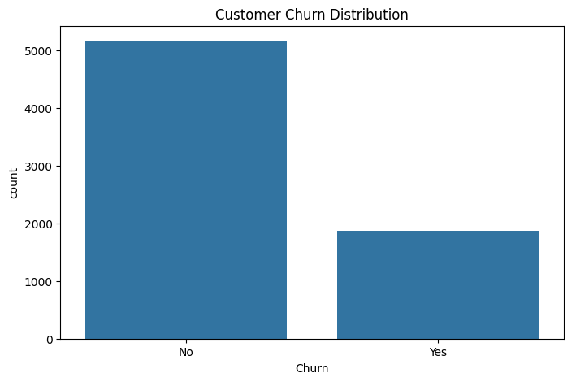
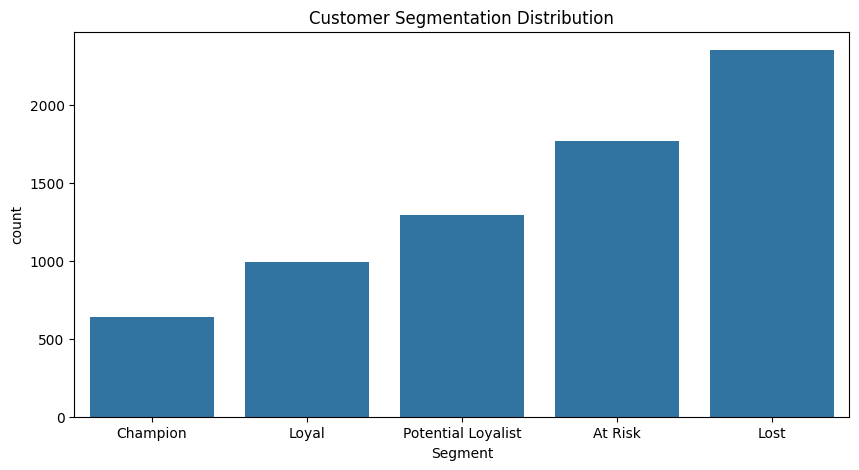
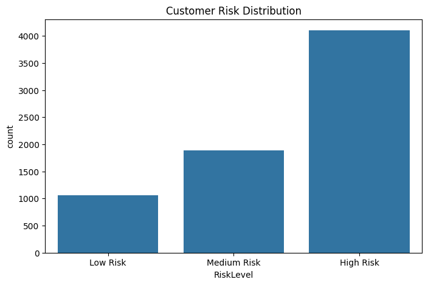
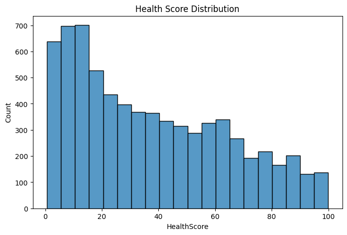
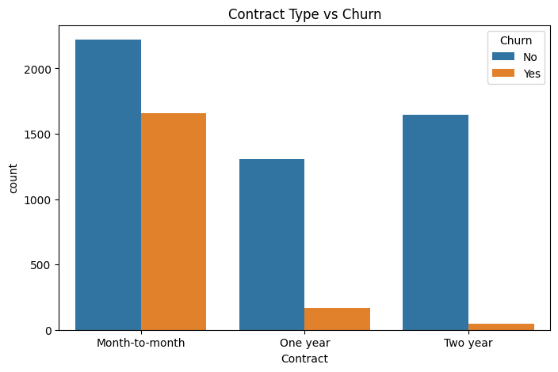

## 🚀 Project Evolution

| Version | Focus |
|----------|--------|
| V1 | Python Analytics & Customer Intelligence |
| V2 | PostgreSQL Analytics Layer |
| V3 (Planned) | Power BI Dashboard Layer |
| V4 (Planned) | Machine Learning Churn Prediction |

# 📊 Customer Churn Intelligence Platform V2

> An end-to-end Customer Analytics and Business Intelligence project that combines Python-based analytics with a PostgreSQL-powered Analytics Layer to identify churn drivers, segment customers, assess customer health, quantify revenue risk, and generate actionable business insights.

---

## 🚀 Project Overview

Customer churn is one of the biggest challenges faced by subscription-based businesses. Acquiring a new customer is significantly more expensive than retaining an existing one, making customer retention a critical business objective.

The **Customer Churn Intelligence Platform V2** was built to analyze customer behavior, identify churn drivers, classify customers based on loyalty and risk, quantify revenue exposure, and provide actionable recommendations for improving customer retention.

Unlike traditional analytics projects, V2 introduces a dedicated PostgreSQL Analytics Layer featuring Views, CTEs, Window Functions, Business KPI Calculations, Revenue Risk Analysis, Customer Segmentation, and Customer Health Scoring.

This project simulates a real-world analytics workflow used by Data Analysts, Business Intelligence Analysts, and Customer Success teams.

---

## 🏗️ Project Architecture

```text
IBM Telco Customer Churn Dataset
                │
                ▼
        PostgreSQL Database
                │
                ▼
       SQL Analytics Layer
                │
     ┌──────────┼──────────┐
     ▼          ▼          ▼
Customer   Health Score  Revenue
Segments   Analytics     Risk
     │          │          │
     └──────────┼──────────┘
                ▼
       Business Intelligence
                │
                ▼
      Executive Insights
```

The project follows a layered analytics architecture where PostgreSQL acts as the primary analytics engine and Python is used for exploratory analysis and visualization.

---

## 🎯 Business Problem

The company wants to answer:

* Why are customers leaving?
* Which customers are most likely to churn?
* Which customers generate the most value?
* How much revenue is at risk?
* Which customer segments require intervention?
* What actions can reduce churn?

This platform provides data-driven answers to these questions.

---

## 📂 Dataset Information

**Dataset:** IBM Telco Customer Churn Dataset

| Metric          | Value              |
| --------------- | ------------------ |
| Records         | 7,043              |
| Features        | 21                 |
| Target Variable | Churn              |
| Industry        | Telecommunications |

### Key Features

* Customer ID
* Gender
* Senior Citizen Status
* Tenure
* Contract Type
* Internet Service
* Payment Method
* Monthly Charges
* Total Charges
* Churn Status

---

## 🗄️ PostgreSQL Analytics Layer

As part of V2, the project was upgraded from a Python-only analytics workflow to a PostgreSQL-powered analytics platform.

### Database Features

* Data Import & Validation
* SQL-Based Data Cleaning
* Data Type Conversion
* Business KPI Calculations
* Customer Segmentation Logic
* Customer Health Score Engine
* Revenue Risk Analysis
* Analytical Views

### SQL Concepts Demonstrated

* SELECT, WHERE, GROUP BY
* ORDER BY, LIMIT, DISTINCT
* CASE WHEN
* Common Table Expressions (CTEs)
* Window Functions (ROW_NUMBER, RANK)
* ALTER TABLE
* UPDATE
* CREATE VIEW
* Aggregations & Business KPIs

---

## 🔄 Project Workflow

```text
Raw Dataset
     │
     ▼
PostgreSQL Import
     │
     ▼
SQL Data Cleaning
     │
     ▼
Exploratory Analysis
     │
     ▼
Customer Segmentation
     │
     ▼
Health Score Analytics
     │
     ▼
Revenue Risk Analysis
     │
     ▼
Business KPI Generation
     │
     ▼
Analytical Views
     │
     ▼
Executive Insights
```

---

## 🧹 Data Cleaning & Data Quality Management

Performed comprehensive data quality assessment using PostgreSQL.

### Data Cleaning Tasks

* Missing Value Detection
* Blank String Investigation
* Data Type Validation
* Data Type Conversion
* Business Rule Validation

### Key Finding

The `TotalCharges` column contained 11 blank records belonging to customers with:

```text
Tenure = 0
```

Instead of removing these records, business logic was applied:

```text
TotalCharges = 0
```

The column was then converted from:

```text
VARCHAR
```

to:

```text
NUMERIC(10,2)
```

using PostgreSQL `ALTER TABLE` operations.

---

## 📈 Exploratory Data Analysis

Investigated customer behavior and churn drivers through SQL-based analysis.

### Questions Answered

* What is the overall churn rate?
* Does contract type affect churn?
* Which payment methods have the highest churn?
* Are high-value customers churning?
* How much revenue is at risk?
* Which customers generate the most value?

### Major Findings

✅ Overall Churn Rate: **26.54%**

✅ Month-to-month contracts have the highest churn rate (**42.71%**)

✅ Two-year contracts have the lowest churn rate (**2.83%**)

✅ Electronic Check customers have the highest churn rate (**45.29%**)

✅ Churned customers generate higher average monthly revenue than retained customers

✅ Revenue at Risk exceeds **$2.86 Million**

---

## 👥 Customer Segmentation

Developed customer segmentation using SQL CASE logic.

### Segments Created

| Segment            | Description                            |
| ------------------ | -------------------------------------- |
| Champion           | Long-term highly engaged customers     |
| Loyal              | Stable customers with strong retention |
| Potential Loyalist | Customers likely to become high-value  |
| At Risk            | Customers requiring retention efforts  |
| Lost               | Newly acquired or disengaged customers |

### Segment Distribution

| Segment            | Customers |
| ------------------ | --------- |
| Potential Loyalist | 1923      |
| Loyal              | 1568      |
| Champion           | 1483      |
| Lost               | 1371      |
| At Risk            | 698       |

---

## ❤️ Customer Health Score Engine

Developed a SQL-based Customer Health Scoring System.

### Inputs

* Tenure
* Monthly Charges
* Total Charges
* Contract Type

### Risk Categories

| Risk Level  | Meaning                     |
| ----------- | --------------------------- |
| Low Risk    | Strong retention indicators |
| Medium Risk | Requires monitoring         |
| High Risk   | High probability of churn   |

### Current Risk Distribution

| Risk Level  | Customers |
| ----------- | --------- |
| High Risk   | 4978      |
| Medium Risk | 1933      |
| Low Risk    | 132       |

---

## 💰 Revenue Risk Analysis

One of the primary objectives of the project is identifying revenue exposure due to customer churn.

### Key Revenue Insights

| Metric                           | Value          |
| -------------------------------- | -------------- |
| Revenue At Risk                  | $2,862,926     |
| Avg Revenue of Churned Customers | $74.44         |
| Highest Revenue Contract Type    | Two Year       |
| Highest Churn Contract Type      | Month-to-Month |

### Business Insight

Customers who churn generate higher average monthly revenue than the overall customer base, indicating that the company is disproportionately losing higher-value customers.

---

## 📊 Analytics Views

The PostgreSQL Analytics Layer exposes reusable analytical views.

### vw_customer_segments

Customer segmentation using SQL CASE logic.

### vw_customer_health

Customer health scoring and risk classification.

### vw_revenue_risk

Revenue exposure analysis for churned customers.

### vw_top_customers

Customer ranking using SQL Window Functions.

---

## 🛠️ Technologies Used

### Database & SQL

* PostgreSQL
* pgAdmin
* SQLTools (VS Code)

### SQL Analytics

* Data Cleaning
* Business KPI Calculations
* Customer Segmentation
* Revenue Risk Analysis
* CTEs
* Window Functions
* Views

### Programming

* Python

### Data Analysis

* Pandas
* NumPy

### Data Visualization

* Matplotlib
* Seaborn

### Development Tools

* Jupyter Notebook
* VS Code
* Git
* GitHub

---

## 📁 Project Structure

```text
Customer-Churn-Intelligence-Platform/
│
├── data/
│   ├── raw/
│   └── cleaned/
│
├── database/
│   ├── schema.sql
│   ├── load_data.sql
│   └── views.sql
│
├── sql/
│   ├── 01_data_exploration.sql
│   ├── 02_customer_analysis.sql
│   ├── 03_customer_segmentation.sql
│   ├── 04_health_score.sql
│   ├── 05_revenue_risk.sql
│   ├── 06_cte_analysis.sql
│   └── 07_window_functions.sql
│
├── docs/
│
├── notebooks/
│
├── screenshots/
│
├── README.md
│
└── requirements.txt
```

---

## 🎯 Skills Demonstrated

* PostgreSQL
* SQL Analytics
* Data Cleaning with SQL
* Data Type Conversion
* Exploratory Data Analysis
* Customer Segmentation
* Customer Health Scoring
* Revenue Risk Analysis
* Business KPI Development
* Statistical Analysis
* Data Visualization
* Views
* CTEs
* Window Functions
* Business Intelligence
* Git & GitHub Workflow

---

## 📷 Dashboard Preview



\



\



\



\



---

## 🏆 Project Outcome

The Customer Churn Intelligence Platform V2 successfully transformed raw customer data into actionable business intelligence by:

* Identifying key churn drivers
* Quantifying customer risk
* Segmenting customers based on engagement
* Estimating revenue exposure
* Ranking high-value customers
* Building reusable SQL analytics views
* Enabling data-driven retention strategies

This project demonstrates a complete analytics workflow that mirrors real-world Business Intelligence and Customer Analytics processes.

---

## 🔮 Future Roadmap

### V3 – Power BI Dashboard Layer

Planned additions:

* Executive Dashboard
* Customer Analytics Dashboard
* Revenue Risk Dashboard
* Churn Insights Dashboard
* Interactive KPI Monitoring

### V4 – Machine Learning Layer

Planned additions:

* Logistic Regression
* Random Forest
* XGBoost
* Churn Probability Prediction
* Customer Lifetime Value Modeling
* Automated Retention Recommendations

---

## 👨‍💻 Author

**Rishabh Singh**

Aspiring Data Analyst | SQL Enthusiast | Machine Learning Learner | Building End-to-End Analytics Solutions with Python, PostgreSQL, and Business Intelligence 🚀

### Connect With Me

* LinkedIn: [www.linkedin.com/in/rishabhsingh290306](http://www.linkedin.com/in/rishabhsingh290306)
* GitHub: https://github.com/RishabhSingh290306

---

⭐ If you found this project useful, consider giving it a star!
